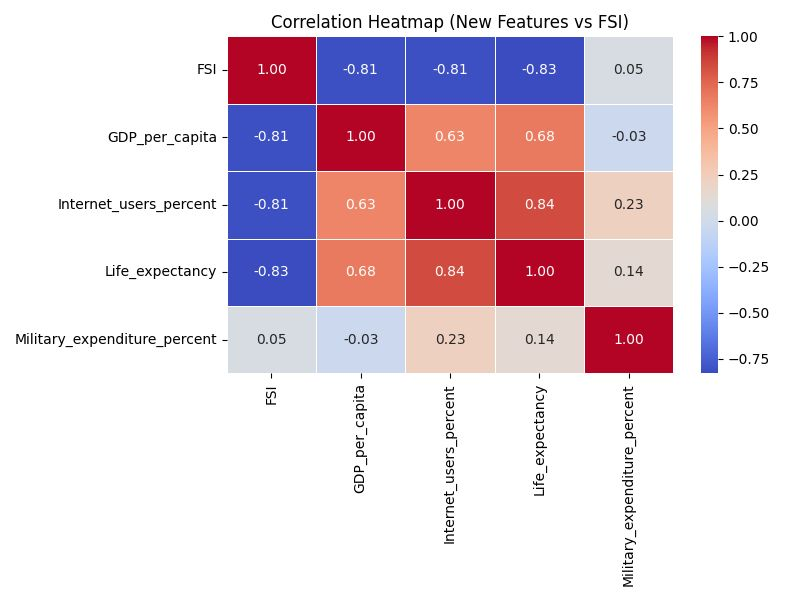
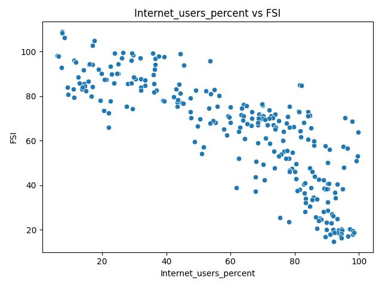
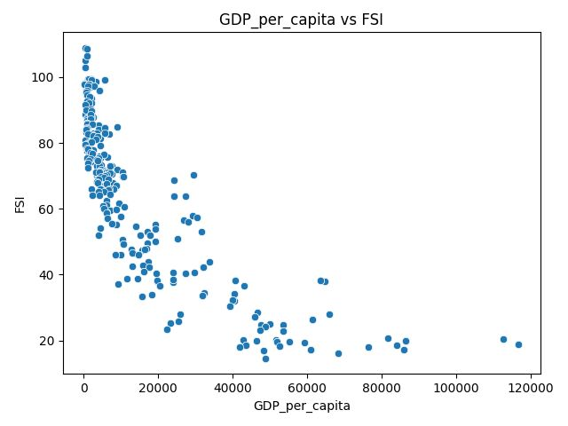
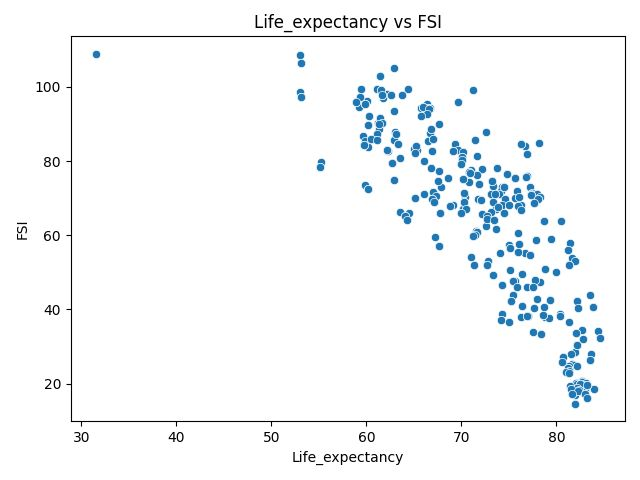
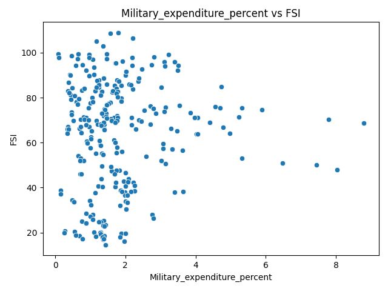

# 📊 Fragile States Index (FSI) – Data Mining & Action Rule Analysis

## 🔍 Overview
This project analyzes the **Fragile States Index (FSI)** using machine learning and action rule mining to identify key socio-economic factors influencing national stability and generate actionable policy insights.

---

## 🎯 Objectives
- Classify countries into fragility categories
- Evaluate impact of external socio-economic features
- Generate actionable rules for improving state stability

---

## 🧠 Methodology

### 📁 Data Sources
- Fragile States Index (2019–2021)
- World Bank datasets:
  - GDP per capita
  - Internet usage
  - Life expectancy
  - Military expenditure

### ⚙️ Data Processing
- Data cleaning & transformation using Python
- Feature integration across datasets
- Discretization for rule mining (Low / Medium / High)

### 🤖 Machine Learning (WEKA)
- J48 Decision Tree  
- Random Forest  
- Bagging  
- PART (Rule-based classifier)

### 🔁 Action Rule Mining
- Tool: **LISP Miner**
- Algorithm: **AC4FT**
- Focus: Transition rules (e.g., Alert → Sustainable)

---

## 📈 Results

| Model | Without Features | With Features | Change |
|------|------------------:|--------------:|-------:|
| Bagging | 90.66% | 90.91% | +0.25% |
| J48 | 92.42% | 92.93% | +0.51% |
| PART | 93.18% | 91.16% | -2.02% |
| Random Forest | 96.46% | 96.21% | -0.25% |

👉 Random Forest achieved the best overall accuracy.  
👉 Additional features did not consistently improve prediction, but they made the models more interpretable.

---

## ⚡ Key Insights
- GDP, Internet usage, and Life Expectancy strongly reduce fragility
- Military expenditure alone has weak correlation
- Multi-factor improvements lead to stronger stability transitions

---

## 🔁 Sample Action Rules
- GDP: Low → High ⇒ Alert → Very Sustainable  
- Internet + Military ⇒ Warning → Very Sustainable  
- Life Expectancy: Medium → High ⇒ Warning → Sustainable  

---

## 📊 Visual Insights

### Correlation Heatmap

  

👉 Strong negative correlations observed:
- GDP per capita, Internet usage, and Life Expectancy show high negative correlation with FSI  
- Indicates higher development → lower fragility  
- Military expenditure shows near-zero correlation, confirming weak predictive value  

---

### Internet Usage vs FSI

  

👉 Clear negative relationship:
- Countries with higher internet penetration tend to have significantly lower FSI scores  
- Suggests digital connectivity improves governance, access to information, and economic participation  

---

### GDP per Capita vs FSI

  

👉 Strongest economic indicator:
- Higher GDP per capita is associated with lower fragility  
- Low-income countries show high variability → instability influenced by multiple factors  
- Wealthier nations cluster in stable FSI ranges  

---

### Life Expectancy vs FSI

  

👉 Strong social indicator:
- Higher life expectancy correlates with lower fragility  
- Reflects better healthcare, living standards, and long-term stability  
- One of the strongest predictors among all features  

---

### Military Expenditure vs FSI

  

👉 Weak and inconsistent relationship:
- No clear trend between military spending and fragility  
- Indicates spending is driven by geopolitical factors rather than stability  
- Becomes meaningful only when combined with other features in multi-factor rules  

---

## 🛠️ Tech Stack
- Python (Data Processing)
- WEKA (Machine Learning)
- LISP Miner (Action Rule Mining)
- Excel / CSV datasets

---

## 📂 Project Structure
- `data/` → Raw & processed datasets  
- `scripts/` → Data cleaning & feature engineering  
- `weka/` → ML-ready datasets  
- `lisp-miner/` → Rule mining datasets  
- `images/` → Visualizations  
- `report/` → Full project documentation  

---

## 📄 Documentation
Full project report available here:  
📌 `report/Data_Mining_Project_Report.pdf`

---

## 🚀 Key Takeaway
This project demonstrates how data mining can move beyond prediction to **actionable decision-making**, providing real-world policy insights.
